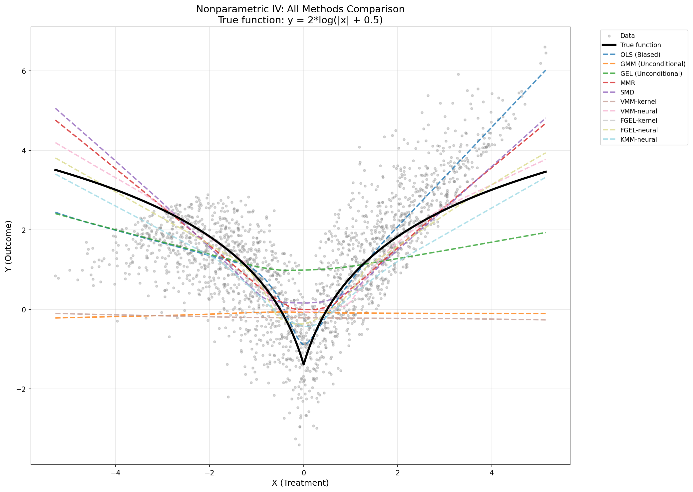

# Estimation with Conditional Moment Restrictions

This repository contains state-of-the-art estimation tools for (conditional) moment restriction problems of the form
```math
E[\psi(X,Y;\theta)|Z] = 0 \  P_Z\text{-a.s.}
```

where e.g. for instrumental variable (IV) regression the moment function becomes $\psi(X,Y;\theta) = Y - f_\theta(X)$ and $Z$ denotes the instruments.

In IV regression one is interested in inferring the functional relation $f$ between random variables $X$ and $Y$ which is obfuscated by a non-observed confounder $U$. The scenario is visualized as a causal diagram below.

<p align="center">

</p>

Parts of the implementation are based on the codebase for the [Variational Method of Moments](https://github.com/CausalML/VMM) estimator.

## Performance on Nonparametric IV

The figure below shows performance of all implemented estimators on a nonparametric IV problem with unobserved confounding, where the true structural function is $y = 2\log(|x| + 0.5)$. Naive OLS fails due to endogeneity bias, while linear IV/GMM methods fail due to model misspecification. The conditional moment restriction methods (MMR, SMD, VMM-neural, FGEL-neural, KMM-neural) successfully recover the nonlinear relationship.

<p align="center">

</p>

**Key observations:**
- **FGEL-neural** (MSE: 0.09) and **VMM-neural** (MSE: 0.14) achieve the best performance
- **MMR** (MSE: 0.17) and **SMD** (MSE: 0.21) provide solid performance with simpler optimization
- **OLS** (MSE: 0.23) exhibits endogeneity bias but still captures some of the relationship
- Unconditional methods (**GMM**, **GEL**) fail to correct for confounding without using the instrument conditionally
- **KMM-neural** (MSE: 0.34) works but is more sensitive to hyperparameters

See [demo_all_methods.py](demo_all_methods.py) for the complete code.

## Installation

To install the package, create a virtual environment and run the setup file from within the folder containing this README:
```bash
python3 -m venv cmr_venv
source cmr_venv/bin/activate
pip install -e .
```

## Usage

### Modern API (Recommended)

The library now supports a type-safe, configuration-based API with automatic GPU detection and smart defaults:

```python
import torch
import numpy as np
from cmr.config import OptimizationConfig, KMMConfig, NetworkConfig
from cmr.methods.kmm_neural import KMMNeural
from cmr.factory import create_estimator

# Generate data
def generate_data(n_sample):
    e = np.random.normal(0, 1.0, size=[n_sample, 1])
    z = np.random.uniform(-3, 3, size=[n_sample, 1])
    t = z + e + np.random.normal(0, 0.1, size=[n_sample, 1])
    y = np.abs(t) + e + np.random.normal(0, 0.1, size=[n_sample, 1])
    return {'t': t, 'y': y, 'z': z}

train_data = generate_data(500)
val_data = generate_data(500)

# Define model and moment function
model = torch.nn.Sequential(
    torch.nn.Linear(1, 50),
    torch.nn.LeakyReLU(),
    torch.nn.Linear(50, 30),
    torch.nn.LeakyReLU(),
    torch.nn.Linear(30, 20),
    torch.nn.LeakyReLU(),
    torch.nn.Linear(20, 1)
)

def moment_function(model_pred, y):
    return model_pred - y

# Option 1: Direct instantiation with config objects
opt_config = OptimizationConfig(
    optimizer='oadam_gda',
    learning_rate=5e-4,
    max_epochs=2000,
    batch_size=200
)
kmm_config = KMMConfig(
    entropy_regularization=10.0,
    rkhs_regularization=1e-2
)
network_config = NetworkConfig(hidden_layers=[50, 30, 20])

estimator = KMMNeural(
    model=model,
    moment_function=moment_function,
    optimization=opt_config,
    kmm_config=kmm_config,
    dual_network=network_config,
    device='auto',  # Automatically detects and uses GPU if available
    verbose=True
)
estimator.train(train_data, val_data)

# Option 2: Factory function with smart defaults
estimator = create_estimator(
    method='KMM-neural',
    model=model,
    moment_function=moment_function,
    train_data_size=len(train_data['t']),  # Auto-configures batch size and optimizer
    regularization=1e-2,
    entropy_regularization=10.0,
    max_epochs=2000
)
estimator.train(train_data, val_data)

# Make predictions
y_pred = estimator.model(torch.Tensor(test_data['t']))
```

**Configuration classes available:**
- `OptimizationConfig`: Optimizer, learning rate, batch size, epochs
- `KMMConfig`: KMM-specific parameters (entropy reg, RKHS reg, random features)
- `FGELConfig`: FGEL-specific parameters (divergence type, regularization)
- `NetworkConfig`: Neural network architecture for dual functions
- `KernelConfig`: Kernel method parameters

**Features:**
- Automatic GPU detection with `device='auto'`
- Type-safe configuration objects
- Smart defaults based on dataset size
- Backward compatible with legacy `**kwargs` API

### High level usage with hyperparameter search

The simplest way to train any moment restriction estimator is via the `estimation` function from [cmr/estimation.py](cmr/estimation.py).
This automatically involves hyperparameter search and early stopping:

```python
from cmr import estimation

trained_model, stats = estimation(
    model=model,
    train_data=train_data,
    moment_function=moment_function,
    estimation_method='KMM-neural',
    **kwargs
)
```

| Argument                | Type | Description                                                   |
|-----------------------|-------------|--------------------------------------------------------|
| `model` | torch.nn.Module | Torch model containing the parameters of interest |
| `train_data` | dict, {'t': t, 'y': y, 'z': z} | Training data with treatments `'t'`, responses `'y'` and instruments `'z'`. For unconditional moment restrictions specify `'z'=None`. |
| `moment_function` | func(model_pred, y) -> torch.Tensor | Moment function $\psi$, taking as input `model(t)` and the responses `y` |
| `estimation_method` | str | See below for implemented estimation methods |
| `estimator_kwargs` | dict | Specify estimator parameters. Default setting is contained in [cmr/default_config.py](cmr/default_config.py)|
| `hyperparams` | dict | Specify estimator hyperparameters search space as `{key: [val1, ...,]}`. Default setting is contained in [cmr/default_config.py](cmr/default_config.py) |
| `validation_data` | dict, {'t': t, 'y': y, 'z': z} | Validation data. If `None`, `train_data` is used for hyperparam tuning.|
| `val_loss_func` | func(model, val_data) -> float | Custom validation loss function. If `None` uses l2 norm of moment function for unconditional MR and HSIC for conditional MR.|
| `normalize_moment_function` | bool | Pretrains parameters and normalizes every output component of `moment_function` to variance 1. |
| `verbose` | bool | If `True` prints out optimization information. If `2` prints out even more. |

### Implemented estimators

| `estimation_method`               | Description                                                   |
|-----------------------|-----------------------------------------------------------|
| **Unconditional moment restrictions**  | |
| `'OLS'`| Ordinary least squares |
| `'GMM'`| Generalized method of moments |
| `'GEL'`| Generalized empirical likelihood |
| `'KMM'`| [Kernel Method of Moments](https://arxiv.org/abs/2305.10898) |
| **Conditional moment restrictions** | |
| `'SMD'`| [Sieve minimum distance](https://onlinelibrary.wiley.com/doi/epdf/10.1111/1468-0262.00470) |
| `'MMR'`| [Maximum moment restrictions](https://arxiv.org/abs/2010.07684) |
| `'VMM-kernel'`| [Variational method of moments](https://arxiv.org/abs/2012.09422) with RKHS instrument function |
| `'VMM-neural'`| [Variational method of moments](https://arxiv.org/abs/2012.09422) with neural net instrument function (i.e., [DeepGMM](https://arxiv.org/abs/1905.12495))|
| `'FGEL-kernel'`| [Functional generalized empirical likelihood](https://proceedings.mlr.press/v162/kremer22a.html) with RKHS instrument function |
| `'FGEL-neural'`| [Functional generalized empirical likelihood](https://proceedings.mlr.press/v162/kremer22a.html) with neural net instrument function |
| `'KMM-neural'`| [Kernel Method of Moments](https://arxiv.org/abs/2305.10898) with neural net instrument function and RF approximation |

## Experiments and reproducibility

To efficiently run experiments with parallel processing refer to [run_experiments.py](run_experiment.py).
As an example you can run:
```bash
python run_experiment.py --experiment heteroskedastic --n_train 256 --method KMM-neural --rollouts 10
```

## Citation

If you use parts of the code in this repository for your own research purposes, please consider citing:
```
@misc{kremer2023estimation,
      title={Estimation Beyond Data Reweighting: Kernel Method of Moments},
      author={Heiner Kremer and Yassine Nemmour and Bernhard Schölkopf and Jia-Jie Zhu},
      year={2023},
      eprint={2305.10898},
      archivePrefix={arXiv},
      primaryClass={cs.LG}
}
```
or
```
@InProceedings{pmlr-v162-kremer22a,
  title = 	 {Functional Generalized Empirical Likelihood Estimation for Conditional Moment Restrictions},
  author =       {Kremer, Heiner and Zhu, Jia-Jie and Muandet, Krikamol and Sch{\"o}lkopf, Bernhard},
  booktitle = 	 {Proceedings of the 39th International Conference on Machine Learning},
  pages = 	 {11665--11682},
  year = 	 {2022},
  editor = 	 {Chaudhuri, Kamalika and Jegelka, Stefanie and Song, Le and Szepesvari, Csaba and Niu, Gang and Sabato, Sivan},
  volume = 	 {162},
  series = 	 {Proceedings of Machine Learning Research},
  month = 	 {17--23 Jul},
  publisher =    {PMLR},
  pdf = 	 {https://proceedings.mlr.press/v162/kremer22a/kremer22a.pdf},
  url = 	 {https://proceedings.mlr.press/v162/kremer22a.html},
}
```
